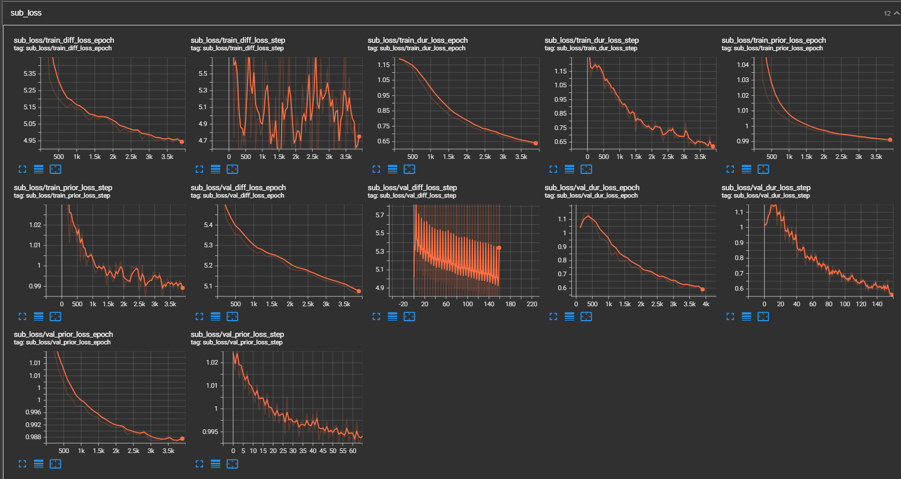
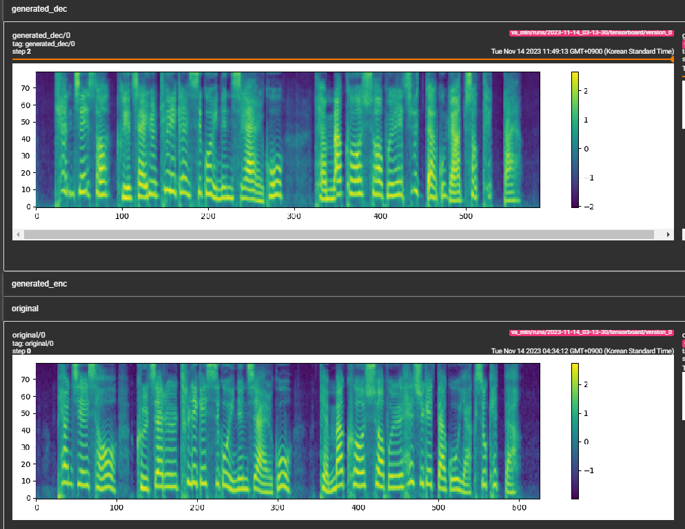
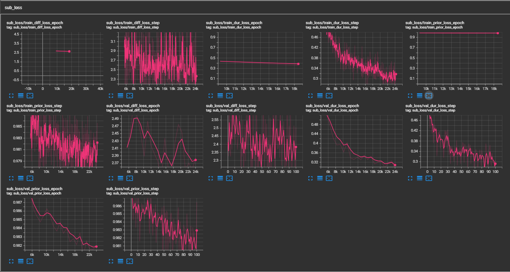

## P-Flow: A Fast and Data-Efficient Zero-Shot TTS through Speech Prompting
### Authors : Sungwon Kim, Kevin J Shih, Rohan Badlani, Joao Felipe Santos, Evelina Bhakturina, Mikyas Desta, Rafael Valle, Sungroh Yoon, Bryan Catanzaro
#### Affiliations: NVIDIA

## Status : Added newer samples with better prosody and pronunciation. Check out `samples` folder. LJSpeech pretrained ckpt - [GDrive Link](https://drive.google.com/drive/folders/1x-A2Ezmmiz01YqittO_GLYhngJXazaF0?usp=sharing)

Unofficial implementation of the paper [P-Flow: A Fast and Data-Efficient Zero-Shot TTS through Speech Prompting](https://openreview.net/pdf?id=zNA7u7wtIN) by NVIDIA.


While recent large-scale neural codec language models have shown significant improvement in zero-shot TTS by training on thousands of hours of data, they suffer from drawbacks such as a lack of robustness, slow sampling speed similar to previous autoregressive TTS methods, and reliance on pre-trained neural codec representations. Our work proposes P-Flow, a fast and data-efficient zero-shot TTS model that uses speech prompts for speaker adaptation. P-Flow comprises a speechprompted text encoder for speaker adaptation and a flow matching generative decoder for high-quality and fast speech synthesis. Our speech-prompted text encoder uses speech prompts and text input to generate speaker-conditional text representation. The flow matching generative decoder uses the speaker-conditional output to synthesize high-quality personalized speech significantly faster than in real-time. Unlike the neural codec language models, we specifically train P-Flow on LibriTTS dataset using a continuous mel-representation. Through our training method using continuous speech prompts, P-Flow matches the speaker similarity performance of the large-scale zero-shot TTS models with two orders of magnitude less training data and has more than 20× faster sampling speed. Our results show that P-Flow has better pronunciation and is preferred in human likeness and speaker similarity to its recent state-of-the-art counterparts, thus defining P-Flow as an attractive and desirable alternative.

## Credits
- Of course the kind author of the paper for taking some time to explain me some details of the paper that I didn't understand at first. 
- We will build this repo based on the [VITS2 repo](https://github.com/p0p4k/vits2_pytorch), [MATCHA-TTS repo](https://github.com/shivammehta25/Matcha-TTS/) and [VoiceFlow-TTS repo](https://github.com/cantabile-kwok/VoiceFlow-TTS)
- Folks at LMNT-com. Try out their ultrafast, realistic TTS models at [lmnt-com](https://app.lmnt.com/). If you like what we're building here, [come join us at LMNT](https://explore.lmnt.com).

# Dry run
``` sh
cd pflowtts_pytorch/notebooks
```
``` python
import sys
sys.path.append('..')

from pflow.models.pflow_tts import pflowTTS
import torch
from dataclasses import dataclass

@dataclass
class DurationPredictorParams:
    filter_channels_dp: int
    kernel_size: int
    p_dropout: float

@dataclass
class EncoderParams:
    n_feats: int
    n_channels: int
    filter_channels: int
    filter_channels_dp: int
    n_heads: int
    n_layers: int
    kernel_size: int
    p_dropout: float
    spk_emb_dim: int
    n_spks: int
    prenet: bool

@dataclass
class CFMParams:
    name: str
    solver: str
    sigma_min: float

# Example usage
duration_predictor_params = DurationPredictorParams(
    filter_channels_dp=256,
    kernel_size=3,
    p_dropout=0.1
)

encoder_params = EncoderParams(
    n_feats=80,
    n_channels=192,
    filter_channels=768,
    filter_channels_dp=256,
    n_heads=2,
    n_layers=6,
    kernel_size=3,
    p_dropout=0.1,
    spk_emb_dim=64,
    n_spks=1,
    prenet=True
)

cfm_params = CFMParams(
    name='CFM',
    solver='euler',
    sigma_min=1e-4
)

@dataclass
class EncoderOverallParams:
    encoder_type: str
    encoder_params: EncoderParams
    duration_predictor_params: DurationPredictorParams

encoder_overall_params = EncoderOverallParams(
    encoder_type='RoPE Encoder',
    encoder_params=encoder_params,
    duration_predictor_params=duration_predictor_params
)

@dataclass
class DecoderParams:
    channels: tuple
    dropout: float
    attention_head_dim: int
    n_blocks: int
    num_mid_blocks: int
    num_heads: int
    act_fn: str

decoder_params = DecoderParams(
    channels=(256, 256),
    dropout=0.05,
    attention_head_dim=64,
    n_blocks=1,
    num_mid_blocks=2,
    num_heads=2,
    act_fn='snakebeta',
)
    
model = pflowTTS(
    n_vocab=100,
    n_feats=80,
    encoder=encoder_overall_params,
    decoder=decoder_params.__dict__,
    cfm=cfm_params,
    data_statistics=None,
)

x = torch.randint(0, 100, (4, 20))
x_lengths = torch.randint(10, 20, (4,))
y = torch.randn(4, 80, 500)
y_lengths = torch.randint(300, 500, (4,))

dur_loss, prior_loss, diff_loss, attn = model(x, x_lengths, y, y_lengths)
# backpropagate the loss 

# now synthesises
x = torch.randint(0, 100, (1, 20))
x_lengths = torch.randint(10, 20, (1,))
y_slice = torch.randn(1, 80, 264)

model.synthesise(x, x_lengths, y_slice, n_timesteps=10)
```
# Quick run in Google Colab
[](https://colab.research.google.com/drive/1tyWDhqfP8ff5O4YcSv9S7TgSpiEyzIvz?usp=sharing)

# Instructions to run
0. Create an environment (suggested but optional)
``` sh
conda create -n pflowtts python=3.10 -y
conda activate pflowtts
```

Stay in the root directory (of course clone the repo first!)
``` sh
cd pflowtts_pytorch
pip install -r requirements.txt
```

1. Build Monotonic Alignment Search 
```sh
# Cython-version Monotonoic Alignment Search
python setup.py build_ext --inplace
```

Let's assume we are training with LJ Speech

2. Download the dataset from [here](https://keithito.com/LJ-Speech-Dataset/), extract it to `data/LJSpeech-1.1`, and prepare the file lists to point to the extracted data like for [item 5 in the setup of the NVIDIA Tacotron 2 repo](https://github.com/NVIDIA/tacotron2#setup).

3a. Go to `configs/data/ljspeech.yaml` and change
```yaml
train_filelist_path: data/filelists/ljs_audio_text_train_filelist.txt
valid_filelist_path: data/filelists/ljs_audio_text_val_filelist.txt
```
3b. Helper commands for the lazy 
```sh
!mkdir -p /home/ubuntu/LJSpeech/LJSpeech-1.1/filelists
!wget -O /home/ubuntu/LJSpeech/LJSpeech-1.1/filelists/ljs_audio_text_test_filelist.txt https://raw.githubusercontent.com/NVIDIA/tacotron2/master/filelists/ljs_audio_text_test_filelist.txt
!wget -O /home/ubuntu/LJSpeech/LJSpeech-1.1/filelists/ljs_audio_text_train_filelist.txt https://raw.githubusercontent.com/NVIDIA/tacotron2/master/filelists/ljs_audio_text_train_filelist.txt
!wget -O /home/ubuntu/LJSpeech/LJSpeech-1.1/filelists/ljs_audio_text_val_filelist.txt https://raw.githubusercontent.com/NVIDIA/tacotron2/master/filelists/ljs_audio_text_val_filelist.txt

!sed -i -- 's,DUMMY,/home/ubuntu/LJSpeech/LJSpeech-1.1/wavs,g' /home/ubuntu/LJSpeech/LJSpeech-1.1/filelists/*.txt

!sed -i -- 's,train_filelist_path: data/filelists/ljs_audio_text_train_filelist.txt,train_filelist_path: /home/ubuntu/LJSpeech/LJSpeech-1.1/filelists/ljs_audio_text_train_filelist.txt,g' /home/ubuntu/LJSpeech/pflowtts_pytorch/configs/data/ljspeech.yaml
!sed -i -- 's,valid_filelist_path: data/filelists/ljs_audio_text_val_filelist.txt,valid_filelist_path: /home/ubuntu/LJSpeech/LJSpeech-1.1/filelists/ljs_audio_text_val_filelist.txt,g' /home/ubuntu/LJSpeech/pflowtts_pytorch/configs/data/ljspeech.yaml
```
4. Generate normalisation statistics with the yaml file of dataset configuration

```bash
cd pflowtts_pytorch/pflow/utils
python generate_data_statistics.py -i ljspeech.yaml
# Output:
#{'mel_mean': -5.53662231756592, 'mel_std': 2.1161014277038574}
```

Update these values in `configs/data/ljspeech.yaml` under `data_statistics` key.

```bash
data_statistics:  # Computed for ljspeech dataset
  mel_mean: -5.536622
  mel_std: 2.116101
```
to the paths of your train and validation filelists.

5. Run the training script

```bash
python pflow/train.py experiment=ljspeech
```

- for multi-gpu training, run

```bash
python pflow/train.py experiment=ljspeech trainer.devices=[0,1]
```

## Architecture details
- [x] Speech prompted text encoder with Prenet and RoPE Transformer
- [x] Duration predictor with MAS
- [x] Flow matching generative decoder with CFM (paper uses wavenet decoder; we use modified wavenet and optional U-NET decoder is included to experiment with)
- [x] Speech prompt input currently slices the input spectrogram and concatenates it with the text embedding. Can support external speech prompt input (during training as well)
- [x] pflow prompt masking loss for training
- [x] HiFiGan for vocoder
- [x] Guidance for sampling

## TODOs, features and update notes
- [x] (11/12/2023) Currently it is an experimental repo with many features substituted with quick architecture implementations I found online. I will add the original architectures soon.
- [x] (11/12/2023) Check out `notebooks` for a quick dry run and architecture testing of the model.
- [x] ~(11/12/2023) Training fails on my dataset at the moment, will debug and fix it soon. But the training the code runs error-free.~
- [x] (11/13/2023) 
    - fixed big mistake in monotonic align build
    - lot of combinations possible within model
    - architecture big picture is same like paper, but internals are different
    - if model doesnt converge, will eventually settle to paper's exact architecture
- [x] (11/13/2023) Tensorboard screenshot
    
- [x] (11/13/2023)
    - added installation instructions
- [x] (11/13/2023)
    - looks like the model is learning and is on the right track. 
    
- [x] (11/14/2023)
    
- [x] (11/14/2023)
    - added Google Colab notebook for quick run
- [x] (11/16/2023)
    - added sample audio
    - some architecture changes
    - we know the model learns, now we need to try multispeaker and check for prosody.
- [x] (11/17/2023)
    - added 3 new branches ->
        - dev/stochastic -> some changes to posterior sampling and text encoder (prior) to make it stochastic
        - dev/encodec -> predicts encodec continuous latent instead of mel spectrogram; if works, use encodec for decoding instead of hifi-gan
        - exp/end2end -> end to end training of pflow with hi-fi gan to generate audio directly from text and speech prompt input; if it works, vits-tts will be obsolete.
- [x] (11/17/2023)
    - 24 epochs encodec sample (although robotic, it is a proof of concept) [encodec_poc.wav](encodec_poc.wav)
- [x] (11/20/2023)
    - Model is more or less ready.
    - Added 3 choices for estimators, need to make them into hyperparameters and add them to the config file.
    - Thanks to [@zidsi](https://github.com/zidsi) for pointing out typos in the code.
- [x] (11/23/2023)
    - Added newer samples with better prosody and pronunciation. Check out `samples` folder. (LJSpeech trained for 300k steps) _Paper recommends 800k steps._
- [x] (12/02/2023)
    - Added guidance for euler solver as recommended by the paper. Improves the quality of the audio drastically. Thanks to @robbit on discord for pointing this out.
- [x] (12/03/2023)
    - Added descript-codec branch for the curious. (not tested yet)
- [x] (01/17/2024)
    - Added minimum wav sample size (in seconds) parameter in the configs (data/[dataset].yaml), `min_sample_size` (default is 4s; so that prompt is at least 3s and prediction is at least 1s)
    - Added `prompt_size` in the configs (models/pflow.yaml) to control the size of the prompt. It is number of mel frames to be used as prompt from the wav sample at traning. (default is ~3s; 3*22050//256 = 258; rounded to 264 in configs) 
    - Added `dur_p_use_log` in the configs (models/pflow.yaml) to control whether to use log of duration prediction or not for loss calculation. (default is False now) My hypothesis is that log durations mse loss doesn't work well for longer pauses etc (due to nature of log function). So, we just `e` power the log durations before calculating the loss. Alternative way can be using relu instead of log.
    - Added `transfer_ckpt_path` in the configs (train.yaml) to control the path of the ckpt to be used for transfer learning. (default is None) If None, then the model is trained from scratch. If not None, then the model is loaded from the ckpt path and trained from step 0. In case, `ckpt_path` is also not None, then the model is loaded from `ckpt_path` and trained from the step it was saved at. `transfer_ckpt_path` can handle layer size mismatches between the ckpt and the model.
- [x] (01/28/2024)
    - Added ONNX export support based on Matcha-TTS repo. (not tested yet, will test soon) {draft}
- [x] (01/30/2024)
    - ONNX tested and works well. Use the arguments in `export.py` and `inference.py` to export and test the model. (the arguemnts are self-explanatory)
- [x] (03/18/2024)
    - added pos embeddings in speech text encoder.
- [x] Anyone is welcome to contribute to this repo. Please feel free to open an issue or a PR.
